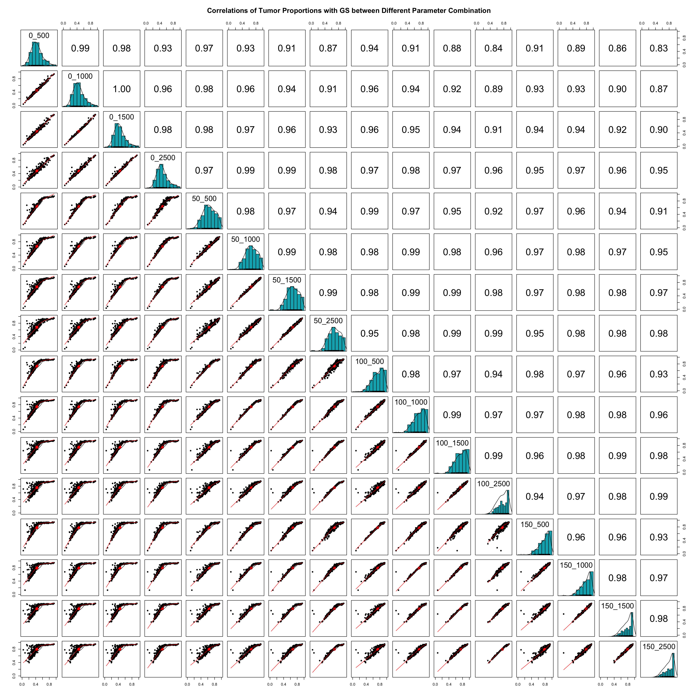

We use the bulk RNAseq data of prostate adenocarcinoma (PRAD) from TCGA (https://portal.gdc.cancer.gov/) as an example to demonstrate how to run ``DeMixT``. The analysis pipeline consists of the following steps:
 
   - Obtaining raw read counts for the tumor and normal RNAseq data 
   - Loading libraries and data
   - Data preprocessing
   - Deconvolution using DeMixT

### 1. Obtain raw read counts for the tumor and normal RNAseq data 
The raw read counts for the tumor and normal samples from TCGA PRAD are downloaded from TCGA data portal ([https://portal.gdc.cancer.gov/](https://portal.gdc.cancer.gov/)). One can also generate the raw read counts from fastq or bam files by following the GDC mRNA Analysis Pipeline ([https://docs.gdc.cancer.gov/Data/Bioinformatics_Pipelines/Expression_mRNA_Pipeline/](https://docs.gdc.cancer.gov/Data/Bioinformatics_Pipelines/Expression_mRNA_Pipeline/)).

### 2. Load libraries and data

##### 2.1 Load libraries

```
library(DeMixT)
library(dplyr)
library(dendextend)
library(psych)
library(DSS)
library(ClassDiscovery)
source('DeMixT_preprocessing.R')
```

##### 2.2 Load input data

Three data are included in the ``PRAD.RData`` file. 
- ``PRAD``: read counts matrix, gene x sample; row names are genes, column names are sample ids.
- ``Normal.id``: TCGA ids of PRAD normal samples.
- ``Tumor.id`` TCGA ids of PRAD tumor samples.

```
load("Data/PRAD.RData")
```

A glimpse of ``PRAD``:
```
head(PRAD[,1:5])
cat('Number of genes: ', dim(PRAD)[1], '\n')

         TCGA-2A-A8VL-01A TCGA-2A-A8VO-01A TCGA-2A-A8VT-01A TCGA-2A-A8VV-01A TCGA-2A-A8W1-01A
TSPAN6               2859             1660             3121             3979             2165
TNMD                    6                0                0               45                0
DPM1                 1348              884             1760             1404             1588
SCYL3                 763              478             1845             1202              654
C1orf112              100               75              274              143              143
FGR                   158              171              227              171              159
Number of genes:  59427 
```

### 3. Data preprocessing

We first conduct data cleaning and normalization before running DeMixT as a preprocessing procedure. The ``R`` function ``DeMixT_preprocessing`` below is available in [DeMixT_preprocessing.R](./etc/DeMixT_preprocessing.R)

```
PRAD = PRAD[, c(Normal.id, Tumor.id)]
label = factor(c(rep('Normal', length(Normal.id)), rep('Tumor', length(Tumor.id))))
cutoff_normal_range = c(0.1, 1.0)
cutoff_tumor_range = c(0, 2.5)
cutoff_step = 0.2

preprocessed_data = DeMixT_preprocessing(PRAD, label, cutoff_normal_range, cutoff_tumor_range, cutoff_step)
PRAD_filter = preprocessed_data$count.matrix
sd_cutoff_normal = preprocessed_data$sd_cutoff_normal
sd_cutoff_tumor = preprocessed_data$sd_cutoff_tumor

cat("Normal sd cutoff:", preprocessed_data$sd_cutoff_normal, "\n")
cat("Tumor sd cutoff:", preprocessed_data$sd_cutoff_tumor, "\n")
cat('Number of genes after filtering: ', dim(PRAD_filter)[1], '\n')
```
Output:

```
Normal sd cutoff: 0.1 0.7
Tumor sd cutoff: 0 0.8
Number of genes after filtering: 9037
```

We first select ~9000 genes before running DeMixT with the GS (Gene Selection) method so that our model-based gene selection maintains good statistical properties. ``DeMixT_preprocessing`` finds the a range of variance in genes from normal samples (``cutoff_normal_range``) and from tumor samples (``cutoff_tumor_range``) which results in roughly 9,000 genes.  ``DeMixT_preprocessing`` outputs a list object ``preprocessed_data``:

- ``preprocessed_data$count.matrix``: preprocesssed count matrix
- ``preprocessed_data$sd_cutoff_normal``
- ``preprocessed_data$sd_cutoff_tumor`` 


### 4. Deconvolution using DeMixT
 - To optimize the ``DeMixT`` parameter setting for the input data, we recommend testing an array of combinations of the number of spike-ins and the number of selected genes.

```
# Because of the random initial values and the spike-in samples within the DeMixT function, we would like to remind the user to set seeds to keep track. This seed setting will be internalized in DeMixT in the next update.

set.seed(1234)

data.Y = SummarizedExperiment(assays = list(counts = PRAD.filter[, Tumor.id]))
data.N1 <- SummarizedExperiment(assays = list(counts = PRAD.filter[, Normal.id]))

# In practice, we set the maximum number of spike-in as min(n/3, 200), where n is the number of samples. 
nspikesin_list = c(0, 50, 100, 150)
# One may set a wider range than provided below for studies other than TCGA.
ngene.selected_list = c(500, 1000, 1500, 2500)

for(nspikesin in nspikesin_list){
    for(ngene.selected in ngene.selected_list){
        name = paste("PRAD_demixt_GS_res_nspikesin", nspikesin, "ngene.selected", ngene.selected,  sep = "_");
        name = paste(name, ".RData", sep = "");
        res = DeMixT(data.Y = data.Y,
                     data.N1 = data.N1,
                     ngene.selected.for.pi = ngene.selected,
                     ngene.Profile.selected = ngene.selected,
                     filter.sd = 0.7, # same upper bound of gene expression standard deviation for normal reference. i.e., preprocessed_data$sd_cutoff_normal[2]
                     gene.selection.method = "GS",
                     nspikein = nspikesin)
        save(res, file = name)
    }
}
```

```
PiT_GS_PRAD <- c()
row_names <- c()

for(nspikesin in nspikesin_list){
    for(ngene.selected in negene.selected_list){
        name_simplify <- paste(nspikesin, negene.selected,  sep = "_")
        row_names <- c(row_names, name_simplify)
        
        name = paste("PRAD_demixt_GS_res_nspikesin", nspikesin, "negene.selected", negene.selected,  sep = "_");
        name = paste("Data/", name, ".RData", sep = "")
        load(name)
        PiT_GS_PRAD <- cbind(PiT_GS_PRAD, res$pi[2, ])
    }
}
colnames(PiT_GS_PRAD) <- row_names
```
 - Calculate and plot the pairwise correlations of estimated tumor proportions across different parameter combinations.

 ```
 pairs.panels(PiT_GS_PRAD,
             method = "spearman", # correlation method
             hist.col = "#00AFBB",
             density = TRUE,  # show density plots
             ellipses = TRUE, # show correlation ellipses
             main = 'Correlations of Tumor Proportions with GS between Different Parameter Combination',
             xlim = c(0,1),
             ylim = c(0,1))
 ```


 - Print out the average pairwise correlation of tumor proportions across different parameter combinations.

```
PiT_GS_PRAD <- as.data.frame(PiT_GS_PRAD)
Spearman_correlations <- list()

for(entry_1 in colnames(PiT_GS_PRAD)) {
  cor.values <- c()
  for (entry_2 in colnames(PiT_GS_PRAD)) {
    if (entry_1 == entry_2)
      next
    
    cor.values <- c(cor.values, cor(PiT_GS_PRAD[, entry_1], PiT_GS_PRAD[, entry_2], method = "spearman"))
  }
  
  Spearman_correlations[[entry_1]] <- mean(cor.values)
}

Spearman_correlations <- unlist(Spearman_correlations)
Spearman_correlations <- data.frame(num.spikein_num.selected.gene=names(Spearman_correlations), mean.correlation=Spearman_correlations)

Spearman_correlations
```

- The average correlation coefficient coefficients are listed below.

```
num.spikein_num.selected.gene   mean.correlation
0_500                           0.9090589	
0_1000	                        0.9380000		
0_1500	                        0.9494419		
0_2500	                        0.9671224		
50_500	                        0.9602793		
50_1000	                        0.9732144		
50_1500	                        0.9716844		
50_2500	                        0.9588510		
100_500	                        0.9632491		
100_1000	                0.9695658	
100_1500	                0.9644836	
100_2500	                0.9487125	
150_500	                        0.9631112	
150_1000	                0.9644836	
150_1500	                0.9546158	
150_2500	                0.9407026
```

 - We suggest selecting the optimal parameter combination that produces the largest average correlation of estimated tumor propotions with those produced by other combinations. The location of the mode of the Pi estimation may also be considered. The mode located too high or too low may suggest biased estimation.

Based on the above criteria, both ``spike-ins = 50`` and ``number of selected genes = 1000``, ``spike-ins = 50`` and ``number of selected genes = 1500`` are the optimal parameter combinations. We can then obtain the corresponding tumor proportions based on ``spike-ins = 50`` and ``number of selected genes = 1000``

```
data.frame(sample.id=Tumor.id, PiT=PiT_GS_PRAD[['50_1000']])

sample.id               PiT
TCGA-2A-A8VL-01A	0.56174265			
TCGA-2A-A8VO-01A	0.60221012			
TCGA-2A-A8VT-01A	0.78682881			
TCGA-2A-A8VV-01A	0.65545788			
TCGA-2A-A8W1-01A	0.87264288			
TCGA-2A-A8W3-01A	0.75036832			
TCGA-CH-5737-01A	0.53433257			
TCGA-CH-5738-01A	0.40521893			
TCGA-CH-5739-01A	0.61147058			
TCGA-CH-5740-01A	0.75048648
```

and the tumor specific expression

```
# res is DeMixT output
res$ExprT[1:5, 1:5]

         TCGA-2A-A8VL-01A TCGA-2A-A8VO-01A TCGA-2A-A8VT-01A TCGA-2A-A8VV-01A TCGA-2A-A8W1-01A
DPM1           1704.18119        1449.0052        1459.1907        1653.4350        1861.6115
SCYL3           986.41202         758.3418        1718.3201        1649.9021         730.3697
C1orf112         97.33428         100.4191         239.8180         155.7776         160.5089
FUCA2          4182.57010        4963.5248         801.0699        4344.4320        1886.4633
GCLC           2044.58982        1519.3045        1197.8271        1253.2875        2041.3444
```

- Instead of selecting using the parameter combination with the highest correlation, one can also select the parameter combination that produces estimated tumor proportions that are most biologically meaningful.

